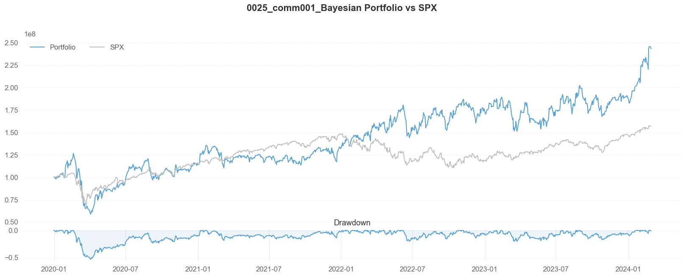

# A Comprehensive Approach to Construct a Portfolio: Factor Model, Bayesian Shrinkage, Black-Litterman Model, and Smart Beta

## Introduction

The primary objective of our project is to maximize the portfolio return by stock selection and allocation. To accomplish this, we have adopted a series of steps. The project course codes are available in the [GitHub repository](https://github.com/laurence1126/Quant-Trading-Strategy).

Firstly, we employ the dual momentum method to select stocks and narrow down the list for portfolio construction. This method combines absolute and relative momentum to identify assets with strong performance potential.

Secondly, we apply Bayesian shrinkage (first layer of Bayesian update) and Black-Litterman Model (second layer of Bayesian update) on factor returns to re-evaluate posterior predictive moments of stock returns with the newest information and investor's view.

Thirdly, we utilize Smart Beta to calculate the weight of each stock within our portfolio. By incorporating the 10 industry factor model and implementation of monthly rebalancing via stock selection, we aim to boost the return of our strategy.

Lastly, we utilize the `Backtrader`[^1] framework and `QuantStats`[^2] for rigorous backtesting to thoroughly evaluate the performance of our strategy. This allows us to assess the historical effectiveness of our approach and make informed decisions on potential refinements.

## Stock Selection

### Dual Momentum Implementation

In our strategy, we implement a six-month formation period for stock selection. This means that we compute the returns of every asset in our stock universe, which comprises the S&P 500 index, over the past six months. This calculation is performed on a rolling basis, with monthly intervals, to ensure regular portfolio rebalancing.

During each rebalancing period, we evaluate the six-month returns of all the assets and adjust the portfolio composition accordingly. Specifically, we select a subset of assets with the highest six-month returns to construct the portfolio. This approach allows us to capture and capitalize on the momentum effect exhibited by assets within the S&P 500 index.

By incorporating this rolling six-month return calculation and frequent portfolio adjustments, our strategy aims to adapt to changing market conditions and exploit potential trends in the selected assets.

```python
clean_stock_price.to_excel("Cleaned SPX Price.xlsx")
clean_stock_price.index = pd.to_datetime(clean_stock_price.index)
clean_stock_semiannually_return = clean_stock_price.resample("M").last().rolling(window=6).apply(
    lambda x: (x[-1] - x[0]) / x[0]).dropna()
clean_stock_semiannually_return.index = [str(i + timedelta(days=15)).rsplit("-", 1)[0] + "-01" for i in clean_stock_semiannually_return.index]
```

### Determining the Stock List

In our stock selection process, we create a long portfolio by sorting the top 50 stocks with the highest returns. However, it is essential to ensure that each stock in the long portfolio has a positive absolute return. If any stock has a negative return, it is removed from the portfolio.

Similarly, we form a short portfolio by selecting the 50 stocks with the lowest returns and negative absolute returns. This ensures that we take advantage of downward price movements in these stocks.

```python
long_list_output = pd.DataFrame(columns=range(1, 51))
short_list_output = pd.DataFrame(columns=range(1, 51))
for i in range(clean_stock_semiannually_return.shape[0]):
    semiannual_return = clean_stock_semiannually_return.iloc[i].values
    sorted_indices = np.argsort(-semiannual_return)
    sorted_semiannual_return = semiannual_return[sorted_indices]
    sorted_company_names = company_names[sorted_indices]
    positive_count = np.sum(sorted_semiannual_return > 0)
    negative_count = np.sum(sorted_semiannual_return < 0)
    positive_number = min(50, positive_count)
    negative_number = min(50, negative_count)
    array_shape = (50,)
    positive_insert_array = np.resize(sorted_company_names[:positive_number], array_shape)
    negative_insert_array = np.resize(sorted_company_names[-negative_number:], array_shape)
    remaining_positive_columns = 50 - positive_number
    remaining_negative_columns = 50 - negative_number
    positive_insert_array[-remaining_positive_columns:] = ''
    negative_insert_array[-remaining_negative_columns:] = ''
    if remaining_positive_columns == 0:
        long_list_output.loc[i] = sorted_company_names[:positive_number]
    else:
        long_list_output.loc[i] = positive_insert_array
    if remaining_negative_columns == 0:
        short_list_output.loc[i] = sorted_company_names[-negative_number:]
    else:
        short_list_output.loc[i] = negative_insert_array
```

## Integration with Bayesian Shrinkage on Factors

### Model Specification

With the factors provided, each stock's return $r_m\text{, } m \in [1, M]$, is modeled by the below equations:

$$
\begin{align*}
r_m &= F\beta_m + \epsilon_m \\
\epsilon_m &\sim \mathcal{N}(0, \sigma^2_m\mathbb{I}_T) \\
f_t &\sim \mathcal{N}(\mu_f, \Lambda_f)
\end{align*}
$$

where $r_m$ is a row vector that represents the return time series of stock $m$ spanning in time $T$, $F = [f_1, \cdots, f_t]^T$ is a $T \times K$ matrix that represents the $K$ factors return time series spanning in time $T$, $\beta_m$ is a $K \times 1$ row vector that represents the factor loadings.

We are aiming to model the Bayesian posterior predictive moments $\text{E}(r_m)$ and $\text{Cov}(r_i, r_j)$, where $m, i, j \in [1, M]$. This will be the input for our Smart Beta (stock weights) calculation.

### Prior Distributions

To maintain closed-form solutions in MV analysis, we adopted fully conjugate and well established priors: **_Zellner’s g-prior_** for $\beta_m$ and **_Normal-Inverse-Wishart prior (Jeffrey’s priors)_** for $\sigma_m^2$ and $(\mu_f, \Lambda_f)$.

$$
\begin{align*}
\beta\mid\sigma_m^2 &\sim \mathcal{N}(\beta_{m, 0}, g\sigma_m^2(F^TF)^{-1}) \\
p(\sigma_m^2) &\propto \frac{1}{\sigma_m^2} \\
p(\mu_f, \Lambda_f) &\propto |\Lambda_f|^{-\frac{K+1}{2}}
\end{align*}
$$

Here we propose $\beta_{m, 0} = \overrightarrow{0}$ to ridge regression, because it benefits estimation by striking a balance between bias and variance. $g$ emerges as a measure of shrinkage intensity. The smaller value of $g$, the stronger shrinkage towards the prior mean $\beta_{m, 0}$. This hyperparameter ($g^*$) will be optimized in the [below section](#determining-shrinkage-intensity). The priors for $\sigma_m^2$ and $(\mu_f, \Lambda_f)$ are essentially uninformative, so we "let the data speak for itself".

### Posterior Distributions

The marginal posterior of $\sigma_m^2$ and $\beta_m$ under the set of prior assumptions is:

$$
\begin{align*}
\sigma_m^2\mid\mathcal{F}  &\sim \text{Inverse-Gamma }(\frac{T}{2}, \frac{SSR_{g, m}}{2}) \\
\beta_m\mid\mathcal{F} &\sim \text{Multivariate t }(T, \overline{\beta_m}, \Sigma_m)
\end{align*}
$$

where

```math
\begin{align*}
SSR_{g, m}&=(r_m - F\hat{\beta}_m)^T (r_m - F\hat{\beta}_m) + \frac{1}{g+1}(\hat{\beta}_m - \beta_{m, 0})^T F^T F(\hat{\beta}_m - \beta_{m, 0}) \\
\overline{\beta_m}&=\frac{1}{g+1} \beta_{m, 0} + \frac{g}{g+1} \hat{\beta}_m \\
\hat{\beta}_m&=(F^T F)^{-1} F^T r_m \\
\Sigma_m&=\frac{g}{g+1}(F^T F)^{-1} \frac{SSR_{g, m}}{T}
\end{align*}
```

```python
# List of Mean and Var of beta_m
def post_beta(self, beta_0=None, g=None) -> tuple[list[np.ndarray], list[np.ndarray]]:
    if not beta_0:
        beta_0 = np.zeros(self.K)
    if not g:
        g = self.g_star
    beta_mean_list = []
    beta_var_list = []
    for m in range(self.M):
        r_m = self.stock_data[:, m]
        beta_hat_m = np.linalg.inv(self.F.T @ self.F) @ self.F.T @ r_m
        beta_m_bar = (beta_0 + g * beta_hat_m) / (1 + g)
        beta_mean_list.append(np.array(beta_m_bar))

        SSR = (r_m - self.F @ beta_hat_m).T @ (r_m - self.F @ beta_hat_m) + 1 / (g + 1) * (beta_hat_m - beta_0).T @ self.F.T @ self.F @ (
            beta_hat_m - beta_0
        )
        sig_m = g / (g + 1) * np.linalg.inv(self.F.T @ self.F) * SSR / self.T
        beta_var_list.append(self.T / (self.T - 2) * sig_m)
    return beta_mean_list, beta_var_list
```

```python
# List of Mean of sigma^2_m (length: m, m is number of stocks)
def post_sig2_mean(self, beta_0=None, g=None) -> list[float]:
    if not beta_0:
        beta_0 = np.zeros(self.K)
    if not g:
        g = self.g_star
    sig2_list = []
    for m in range(self.M):
        r_m = self.stock_data[:, m]
        beta_hat_m = np.linalg.inv(self.F.T @ self.F) @ self.F.T @ r_m
        SSR = (r_m - self.F @ beta_hat_m).T @ (r_m - self.F @ beta_hat_m) + 1 / (g + 1) * (beta_hat_m - beta_0).T @ self.F.T @ self.F @ (
            beta_hat_m - beta_0
        )
        sig2_list.append(SSR / 2 / (self.T / 2 - 1))
    return sig2_list
```

The marginal posterior of $\mu_f$ and $\Lambda_f$ under the set of prior assumptions is:

$$
\begin{align*}
\mu_f\mid\mathcal{F} &\sim \text{Multivariate t }(T-K, \bar{f}, \frac{\Lambda_n}{T(T-K)}) \\
\Lambda_f\mid\mathcal{F} &\sim \text{Inverse-Wishart }(T − 1, \Lambda_n)
\end{align*}
$$

where

$$
\begin{align*}
\Lambda_n &= \sum^T_{t=1}(f_t - \bar{f})(f_t - \bar{f})^T \\
\bar{f} &= \frac{1}{T}\sum^T_{t=1}f_t
\end{align*}
$$

```python
# Mean and Var of miu_f
def post_miu_f(self) -> tuple[np.ndarray, np.ndarray]:
    f_bar = np.array(self.F.mean(axis=0)).T
    Lambda_n = np.zeros((self.K, self.K))
    for t in range(self.T):
        f_t = self.F[t, :]
        Lambda_n += np.outer(f_t - f_bar, f_t - f_bar)
    # Without views about future factor returns
    if self.P is None or self.Q is None:
        miu_f_mean = f_bar
        miu_f_var = 1 / (self.T - self.K - 2) * Lambda_n / self.T
    return miu_f_mean, miu_f_var
```

```python
# Mean of Lambda_n
def post_Lambda_n(self) -> np.ndarray:
    f_bar = self.F.mean(axis=0)
    Lambda_n = np.zeros((self.K, self.K))
    for t in range(self.T):
        f_t = self.F[t, :]
        Lambda_n += np.outer(f_t - f_bar, f_t - f_bar)
    return Lambda_n / (self.T - self.K - 2)
```

### Determining Shrinkage Intensity

For Zellner’s g-prior with $\beta_{m,0} = \overrightarrow{0}$, the marginal likelihood $p(r_m\mid g)$ has a known explicit form:

$$
p(r_m \mid g)=\Gamma(\frac{T-1}{2}) \pi^{-\frac{T-1}{2}} T^{-\frac{1}{2}}\|r_m-\overline{r_m}\|^{-(T-1)} \frac{(1+g)^{(T-K-1) / 2}}{(1+g(1-R^2))^{(T-1) / 2}}
$$

where $\displaystyle R = 1 - \frac{(r_m - F\hat{\beta_m})^T (r_m - F\hat{\beta_m})}{(r_m - \overline{r_m})^T (r_m - \overline{r_m})}$ is the coefficient of determination.

Then we employ the empirical Bayes estimate $g^∗$, which maximizes the marginal (log) likelihood:

$$
\begin{align*}
g^∗ &= \arg\max_g \prod_{m=1}^m p(r_m \mid g) \\
    &= \arg\max_g \prod_{m=1}^m \ln p(r_m \mid g) \\
    &= \arg\min_g \sum_{m=1}^M[-\frac{T-K-1}{2} \ln(1+g)+\frac{T-1}{2} \ln(1+g(1-R^2))]
\end{align*}
$$

```python
# Objective function for finding g*
def g_likelihood(self, g) -> float:
    R_squared_list = []
    for m in range(self.M):
        r_m = self.stock_data[:, m]
        r_m_bar = r_m.mean(axis=0)
        beta_hat_m = np.linalg.inv(self.F.T @ self.F) @ self.F.T @ r_m
        R_squared_m = 1 - ((r_m - self.F @ beta_hat_m).T @ (r_m - self.F @ beta_hat_m)) / ((r_m - r_m_bar).T @ (r_m - r_m_bar))
        R_squared_list.append(R_squared_m)
    R_squared_list = np.array(R_squared_list)
    return sum(-(self.T - self.K - 1) / 2 * np.log(1 + g) + (self.T - 1) / 2 * np.log(1 + g * (1 - R_squared_list)))
```

### Determining Posterior Predictive Moments of $r_m$

Denote $\text{E}[\cdot\mid\mathcal{F}] = \text{E}[\cdot], \text{Var}[\cdot\mid\mathcal{F}] = \text{Var}[\cdot], \text{Cov}[\cdot\mid\mathcal{F}] = \text{Cov}[\cdot]$, then the posterior predictive moments of stock returns under the Bayesian factor model are:

```math
\begin{align*}
\text{E}[r_m]&=\text{E}[\beta_m]^T \text{E}[\mu_f] \\
\text{Var}[r_m]&=\text{E}[\sigma_m^2]+\text{Tr}(\text{E}[f f^T] \text{Var}[\beta_m])+\text{E}[\beta_m]^T \text{Var}[f] \text{E}[\beta_m] \\
\text{Cov}(r_i, r_j)&=\text{E}[\beta_i]^T \text{Var}[f] \text{E}[\beta_j]
\end{align*}
```

where

$$
\begin{align*}
\text{E}[f f^T]&=\text{E}[\Lambda_f]+\text{Var}[\mu_f]+\text{E}[\mu_f] \mathbb{E}[\mu_f]^T \\
\text{Var}[f]&=\text{E}[\Lambda_f]+\text{Var}[\mu_f]
\end{align*}
$$

with $\text{E}[\mu_f], \text{Var}[\mu_f], \text{E}[\sigma_m^2], \text{E}[\beta_m], \text{Var}[\beta_m], \text{E}[\Lambda_f]$ obtained from the posterior distributions after Bayesian updates mentioned above.

```python
# Posterior predictive return distribution (mean vector and covariance matrix) and shrinkage parameter g*
def posterior_predictive(self) -> tuple[np.ndarray, np.ndarray, float]:
    sig2_mean = self.post_sig2_mean()
    miu_f_mean, miu_f_var = self.post_miu_f()
    Lambda_n_mean = self.post_Lambda_n()
    beta_mean_list, beta_var_list = self.post_beta()

    f_ft_mean = Lambda_n_mean + miu_f_var + np.outer(miu_f_mean, miu_f_mean)
    f_var = Lambda_n_mean + miu_f_var

    r_mean_list = []
    r_cov_mat = np.zeros((self.M, self.M))
    for m in range(self.M):
        r_mean = beta_mean_list[m] @ miu_f_mean
        r_mean_list.append(r_mean)
        for j in range(m, self.M):
            if m == j:
                r_cov_mat[m, m] = sig2_mean[m] + np.trace(f_ft_mean @ beta_var_list[m]) + beta_mean_list[m].T @ f_var @ beta_mean_list[m]
            else:
                r_cov_mat[m, j] = beta_mean_list[m].T @ f_var @ beta_mean_list[j]
                r_cov_mat[j, m] = r_cov_mat[m, j]
    return np.array(r_mean_list), np.array(r_cov_mat), self.g_star
```

### Tracking Estimates’ Differences

To track the difference of mean and covariance matrix between Bayesian approach and historical data sample approach, we employed two distance metrics:

```math
\begin{align*}
d_1(\mathbf{a}, \mathbf{b}) &= \sum_{i=1}^M \mid \mathbf{a}_i - \mathbf{b}_i \mid \\
d_1(A, B) &= \sum_{i=1}^M \sum_{j=1}^i \mid A_{i,j} - B_{i,j} \mid
\end{align*}
```

The below plots shows the estimates’ difference and estimated $g^*$ at each time point on **_randomly selected_** stocks (i.e. every fifth stock in S&P 500) over last decade:


We note that there is a significant shock on distance in covariance estimate and $g*$, likely resulted from the abnormal behavior of stock prices during the COVID-19 period.

## Integration with Black-Litterman Model on Factors

### Second Layer of Bayesian Update

In this section, we are aiming to incorporate investor's forward-looking analyses on return and covariance matrix of the **_underlying factors_** via the second layer of Bayesian update. These information are not necessarily captured by the historical data, but can be strategically integrated into the statistical model. Here we only discuss its application on factor returns $\mu_f$.

### Model Specification of $\mu_f$

Let $P \in \mathbb{R}^{N×K}$ denote a full-ranked pick matrix, $Q \in \mathbb{R}^N$ represent the views vector. A relative view $x\%$ on $F_1$ outperform $F_2$, and an absolute view $y\%$ on $F_2$ can be represented as:

$$
P = \begin{bmatrix}
1 & -1 & 0 \\
0 & 1 & 0 \\
\end{bmatrix},
\qquad
Q = \begin{bmatrix}
x\% \\
y\% \\
\end{bmatrix}
$$

With the formulation:

$$ Q = P\mu_f + \epsilon $$

and assume that the noise $\epsilon$ and $\mu_f$ have a joint multivariate Student-t distribution conditional on $\mathcal{F}$, where $\text{Var}(\epsilon|\mathcal{F}) = Ω$, and $\text{Cov}(\epsilon, \mu_f|\mathcal{F}) = 0$. The covariance matrix, $\Omega$, reflects one’s confidence in a particular view. A larger variance indicates uncertainty, dampening its influence on the updated belief. In the Black-Litterman model, it’s commonly assumed that $\Omega$ is diagonal.

### Posterior Distribution of $\mu_f$

According to Schöttle et al. (2010), the updated joint posterior distribution of $\mu_f$ and $Q$ also follows multivariate Student-t distribution. Hence, the marginal posterior distribution of $\mu_f$ after the second Bayesian update is:

$$
\begin{align*}
    \mu_f \mid \mathcal{F}, Q=q \sim \text{Multivariate t }\Big(T-K,
    \bar{f}+\Sigma_n P^T(P \Sigma_n P^T+\Omega)^{-1}(q-P \bar{f}), \\
    \Sigma_n-\Sigma_n P^T(P \Sigma_n P^T+\Omega)^{-1} P \Sigma_n\Big)
\end{align*}
$$

where $\Sigma_n = \frac{\Lambda_n}{T(T-K)}$. If we further infer that the error $\epsilon$ in $Q$ arises from a lifted uncertainty in $\mu_f$, then:

$$
\Omega = cP\Sigma_nP^T
$$

for some constant $c>0$.

Subsequent to the second Bayesian update, the posterior distribution of $\mu_f$ is:

$$
\begin{align*}
    \mu_f \mid \mathcal{F}, Q=q \sim \text{Multivariate t }\Big(T-K,
    \bar{f}+(\frac{1}{c+1}) \Sigma_n P^T(P \Sigma_n P^T)^{-1}(q-P \bar{f}), \\
    \Sigma_n-(\frac{1}{c+1}) \Sigma_n P^T(P \Sigma_n P^T)^{-1} P \Sigma_n\Big)
\end{align*}
$$

```python
def post_miu_f(self) -> tuple[np.ndarray, np.ndarray]:
        f_bar = np.array(self.F.mean(axis=0)).T
        Lambda_n = np.zeros((self.K, self.K))
        for t in range(self.T):
            f_t = self.F[t, :]
            Lambda_n += np.outer(f_t - f_bar, f_t - f_bar)
        # With views about future factor returns
        if self.P == "absolute":
            self.P = np.eye(self.K)
        elif self.P == "relative":
            self.P = np.eye(self.K)
            for i in range(self.K - 1):
                self.P[i, i + 1] = -1
        if not self.c:
            self.c = np.sqrt(self.T)
        Sigma_n = Lambda_n / self.T / (self.T - self.K)
        miu_f_mean = f_bar + 1 / (self.c + 1) * Sigma_n @ self.P.T @ np.linalg.inv(self.P @ Sigma_n @ self.P.T) @ (self.Q - self.P @ f_bar)
        miu_f_var = (
            (self.T - self.K)
            / (self.T - self.K - 2)
            * (Sigma_n - 1 / (self.c + 1) * Sigma_n @ self.P.T @ np.linalg.inv(self.P @ Sigma_n @ self.P.T) @ self.P @ Sigma_n)
        )
        return miu_f_mean, miu_f_var
```

In scenarios where $c$ approaches zero, $Q$ accurately mirrors $P_{μ_f}$. Conversely, as $c \rightarrow \infty$, $Q=q$ loses its significance, defaulting back to the original posterior distribution.

## Integration with Smart Beta

After we have obtained the Bayesian predictive posterior mean and covariance matrix of stock returns, we employed Smart Beta to calculate the weight of each stock within our portfolio. The methods include Risk Parity, Maximum Diversification Ratio (MDR), Global Minimum Variance (GMV), and Maximum Sharpe Ratio (MSR) as mentioned in the lecture note.

We also add a weight calculation scheme that allows us to specify a required expected return $(\tilde{r})$ for the next period, while minimize the variance of the portfolio, i.e. add the following constrain additional to GMV:

$$
\tilde{r} = w^T\text{E}(r)
$$

## Portfolio Construction

With our selected stocks via [Dual Momentum](#dual-momentum-implementation) approach and factors data (10 industry portfolios fetched from [Fama and French Database](https://mba.tuck.dartmouth.edu/pages/faculty/ken.french/Data_Library/det_10_ind_port.html), following the paper's approach), we use the preceding 252 days’ returns for parameters estimation and Bayesian update at the end of each trading day. Then with the posterior predictive moments of $r_m$, we obtain the next trading day's weights for each stock through Smart Beta calculation. Finally, we hold the newly-weighted portfolio for one day and rebalcance the weight daily.

The universe of stock selection is rebalanced monthly (i.e. at the first trading day of each month). For the long only stocks, we set the boundary for weight: $w_i \in (0, 1)$, for $i \in [1, M]$, and for short only stocks, we set the boundary for weight: $w_i \in (-1, 0)$, for $i \in [1, M]$. We also choose the parameter $\beta_{m, 0} = \overrightarrow{0}$ and $g^*$ be the MLE.

### A Simple Performance Evaluation

This section serves as a really simplified cumulative returns comparison of each strategy (no transaction cost, no dividend adjustment, no market liquidity assumption, purely based on the closing price) on the **_long only_** stocks selected by the Dual Momentum approach. The evaluation period is from 2020-01-01 to 2024-02-29.

For the long only stocks, we notice that the equal weight strategy has already beat the market after stock selection. For the MDR scheme, even though the Bayesian approach beat the sample approach, they both fail to outperform the equal weight strategy.


It is more interesting to take a look at the cumulative return when we specify a required daily return. We discovered that when we specify a relative small required return (0.1%, daily) or extremely large required return (1%, daily), which deviate from equal weight method daily return a lot, the Bayesian approach tends to fail.


However, when we adjust the required daily return to 0.2% or 0.25%, Bayesian approach beat the sample approach again. The Bayesian approach even earned an extremely abnormal return. This may result from allocating heavy weight to a single stock, which can be interpreted as its ability to capture the "trading signal".


## Backtesting

In order to assess the performance of our portfolio relative to the benchmark SPX500, we employ backtesting techniques utilizing the `Backtrader`[^1] and `QuantStats`[^2] libraries. `Backtrader` stands as a widely-used Python library designed for backtesting trading strategies, while `QuantStats` serves as a complementary Python library tailored for comprehensive portfolio analytics. Through the integration of these tools, we aim to rigorously evaluate the performance of our strategy by using the generated portfolio weights in comparison to the SPX500 benchmark.

[^1]: For detailed information on `Backtrader`, please visit: [`Backtrader` Documentation](https://www.backtrader.com/).
[^2]: The source code for `QuantStats` can be found at: [`QuantStats` GitHub Repository](https://github.com/ranaroussi/quantstats).

### Backtesting Setting

Utilizing `Backtrader`, our methodology entails replicating the daily rebalancing of the portfolio in accordance with the [weights generated by our strategy](#integration-with-smart-beta). With a portfolio comprising around 100 stocks, the [selection of stocks](#determining-the-stock-list) is revised monthly based on prevailing market conditions. Consequently, our stock universe undergoes monthly adjustments, with purchases and sales executed daily in alignment with the specified weights.

The operational logic is as follows: leveraging the close price data for the current day, we calculate the requisite weights and corresponding share allocations. These share allocations are rounded down to integers, and orders are placed at the opening price of the subsequent day. We operate under the assumption of seamless execution at the opening price, devoid of any market impact.

When configuring `Backtrader`, we eschew predefined templates for the data feeds, as only the open and close prices for all SPX stocks are required. Additionally, a new observer is integrated to calculate the portfolio value at each time point. The initial cash allocation is fixed at $100,000,000, with a margin of 10% and a commission rate of 0.1% applied. The execution of the backtesting is facilitated by the `Cerebro` engine.

```python
# define portfolio data feeds
class PandasData(bt.feeds.PandasData):
    lines = ("open", "close")
    params = (
        ("datetime", None),  # use index as datetime
        ("open", 0),  # the [0] column is open price
        ("close", 1),  # the [1] column is close price
        ("high", 0),
        ("low", 0),
        ("volume", 0),
        ("openinterest", 0),
    )

# new observer for portfolio
class PortfolioValueObserver(bt.Observer):
    lines = ("value",)
    plotinfo = dict(plot=True, subplot=True)

    def next(self):
        self.lines.value[0] = self._owner.broker.getvalue()

# backtest given prices, weights, initial cash, commission fee
def RunBacktest(stock_list, combined_df, weights_df, ini_cash, comm_fee, notify, log):
    cerebro = bt.Cerebro()  # initiate cerebro engine

    # load data feeds
    for col in stock_list:
        data = PandasData(dataname=combined_df[[col + "_open", col + "_close"]])
        cerebro.adddata(data, name=col)

    # strategy setting
    weights_df = weights_df / weights_df.sum(axis=1).values.reshape(-1, 1) * 0.9  # margin
    # set initial cash
    cerebro.broker.setcash(100000000)
    cerebro.broker.setcommission(commission=comm_fee)  # set commission
    cerebro.addstrategy(BLStrategy, weights=weights_df, stocks=stock_list, printnotify=False, printlog=False)  # set strategy
    cerebro.addobserver(PortfolioValueObserver)  # add observer
    cerebro.addanalyzer(bt.analyzers.PyFolio, _name="pyfolio")  # add analyzer

    # run the strategy
    results = cerebro.run()
    return results
```

Following the computation of daily returns by subtracting the commission from the portfolio value return using `Backtrader` backtesting, the subsequent analysis leverages `QuantStats` to comprehensively evaluate portfolio performance. Key metrics, including cumulative return, annualized return, annualized volatility, Sharpe ratio, Sortino ratio, maximum drawdown, Calmar ratio, value-at-risk, and expected shortfall, are meticulously assessed. `QuantStats` streamlines the process by automatically generating a report containing all the metrics and plots. Additionally, we aim to dynamically compare the performance of our portfolio with the benchmark SPX500, while also visualizing the dynamic drawdown plot of the portfolio.

### Backtesting Implements

The data utilized for backtesting purposes is sourced from **iFind**, encompassing the close price data for the SPX500 index, as well as the open[^3] and close[^4] prices for all individual stocks within the SPX500 index[^6]. The portfolio weights, as previously mentioned, are generated through our strategy[^5]. To ensure data integrity, missing values are replaced with `NaN`, and the index is configured to `datetime` format. Our backtesting approach involves testing our strategy with weights generated by targeting daily returns of 1.5%, 2%, and 2.5% using the [Bayesian approach](#integration-with-bayesian-shrinkage-on-factors).

[^3]: The open price data can be downloaded from [here](https://raw.githubusercontent.com/laurence1126/Quant-Trading-Strategy/main/data/S&P%20500%20Trading%20Volume,%20%20Open%20Price%2014-24.xlsx).
[^4]: The close price data can be downloaded from [here](https://raw.githubusercontent.com/laurence1126/Quant-Trading-Strategy/main/data/S&P500%20Daily%20Closing%20Price%202014-2024.xlsx).
[^5]: The weights for target daily return = 1.5% are available for download from [here](https://raw.githubusercontent.com/laurence1126/Quant-Trading-Strategy/main/output/long_SpecReturn_0015.xlsx), for target daily return = 2% are available for download from [here](https://raw.githubusercontent.com/laurence1126/Quant-Trading-Strategy/main/output/long_SpecReturn_002.xlsx), and for target daily return = 2.5% are available for download from [here](https://raw.githubusercontent.com/laurence1126/Quant-Trading-Strategy/main/output/long_SpecReturn_0025.xlsx)

Given the target daily return and the approach for generating weights, we utilize the `LoadData` function to load the stock lists, price data, and weights data for each of the stocks. By inputting the acquired data along with our initialization parameters such as initial cash and commission fee into the `RunBacktest` function, we obtain the backtesting results. These results, along with the SPX500 index prices[^6], are then utilized to generate a comprehensive report using the `PortReport` function.

[^6]: SPX500 index close prices are available [here](https://raw.githubusercontent.com/laurence1126/Quant-Trading-Strategy/main/data/SPX%20Daily%20Closing%20Price%2014-24.xlsx)

### Backtesting Results

The backtesting results for three target daily returns indicated that a target daily return of 0.15% exhibited the poorest performance. Despite yielding a positive return, it underperformed the market (SPX500). Conversely, the other two target daily returns showcased superior performance compared to the market. This disparity in performance is visually evident in the comparison plots between the market and portfolio value below. However, it is notable that the drawdown appears to be more significant when the market is in a downturn.




In addition to the drawdown and portfolio value, we also present the key performance metrics for the three target daily returns in the table below:

| Metric              | Value  | Metric                  | Value   |
| ------------------- | ------ | ----------------------- | ------- |
| Target Daily Return | 0.015  | Cumulative Return       | 33.12%  |
| Annualized Return   | 4.86%  | Annualized Volatility   | 26.53%  |
| Sharpe Ratio        | 0.4    | Sortino Ratio           | 0.54    |
| Calmar Ratio        | 0.1    | Maximum Drawdown        | -47.24% |
| Value-at-Risk (VaR) | -2.71% | Expected Shortfall (ES) | -2.71%  |

| Metric              | Value  | Metric                  | Value   |
| ------------------- | ------ | ----------------------- | ------- |
| Target Daily Return | 0.02   | Cumulative Return       | 74.62%  |
| Annualized Return   | 9.68%  | Annualized Volatility   | 31.13%  |
| Sharpe Ratio        | 0.59   | Sortino Ratio           | 0.83    |
| Calmar Ratio        | 0.21   | Maximum Drawdown        | -46.16% |
| Value-at-Risk (VaR) | -3.15% | Expected Shortfall (ES) | -3.15%  |

| Metric              | Value  | Metric                  | Value   |
| ------------------- | ------ | ----------------------- | ------- |
| Target Daily Return | 0.025  | Cumulative Return       | 143.35% |
| Annualized Return   | 15.89% | Annualized Volatility   | 36.69%  |
| Sharpe Ratio        | 0.77   | Sortino Ratio           | 1.1     |
| Calmar Ratio        | 0.3    | Maximum Drawdown        | -53.62% |
| Value-at-Risk (VaR) | -3.69% | Expected Shortfall (ES) | -3.69%  |

We have also generated more comprehensive plots and tables for the backtesting results. For detailed reports, please refer to the following links[^7].

[^7]: The detailed report for target daily return = 0.015% can be found [here](https://gavin-op.github.io/component/page/backtest_0015_comm001_Bayesian_report.html), for target daily return = 0.02% can be found [here](https://gavin-op.github.io/component/page/backtest_002_comm001_Bayesian_report.html), and for target daily return = 0.025% can be found [here](https://gavin-op.github.io/component/page/backtest_0025_comm001_Bayesian_report.html).

## Appendices

1. [DualMomentum.py](https://raw.githubusercontent.com/laurence1126/Quant-Trading-Strategy/main/src/DualMomentum.py)
2. [PCA.py](https://raw.githubusercontent.com/laurence1126/Quant-Trading-Strategy/main/src/PCA.py)
3. [Bayesian_Posterior.py](https://raw.githubusercontent.com/laurence1126/Quant-Trading-Strategy/main/src/Bayesian_Posterior.py)
4. [Weight_Calc.py](https://raw.githubusercontent.com/laurence1126/Quant-Trading-Strategy/main/src/Weight_Calc.py)
5. [Backtesting.py](https://raw.githubusercontent.com/laurence1126/Quant-Trading-Strategy/main/src/Bayesian_Posterior.py)
6. [Config.py](https://raw.githubusercontent.com/laurence1126/Quant-Trading-Strategy/main/src/Config.py)
7. [main.py](https://raw.githubusercontent.com/laurence1126/Quant-Trading-Strategy/main/src/main.py)
